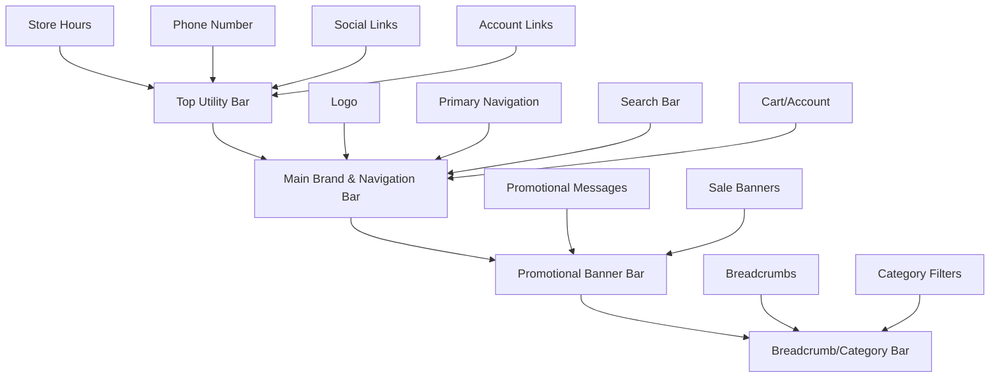
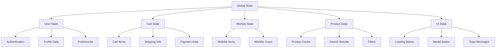
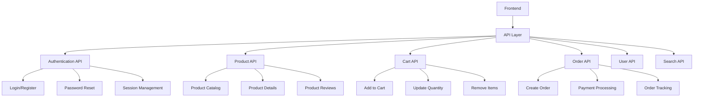
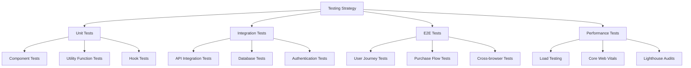

# Uniform Advantage Website Clone Design Document

## Overview

This design document outlines the complete implementation strategy for creating a pixel-perfect clone of the Uniform Advantage website (uniformadvantage.com). The project will recreate an e-commerce platform specializing in medical uniforms, scrubs, and healthcare apparel for healthcare professionals including nurses, doctors, and medical staff.

### Project Goals
- Create an identical visual replica of uniformadvantage.com
- Implement modern e-commerce functionality
- Ensure mobile-responsive design
- Optimize for performance and SEO
- Build scalable architecture for high traffic

### Target Audience
- Healthcare professionals (nurses, doctors, medical staff)
- Medical facilities and hospitals
- Healthcare students
- Veterinary professionals

## Technology Stack & Dependencies

### Frontend Framework
- **React 18+** with **Next.js 15** for server-side rendering
- **TypeScript** for type safety and development efficiency
- **Tailwind CSS** for styling (already configured)
- **Framer Motion** for animations and transitions
- **Radix UI** components for accessible UI elements

### State Management & Data Fetching
- **React Query/TanStack Query** for server state management
- **Zustand** or **React Context** for client state
- **React Hook Form** for form management

### Authentication & Security
- **NextAuth.js** or **Auth0** for authentication
- **bcrypt** for password hashing
- **JWT** for session management

### Payment & E-commerce
- **Stripe** integration for payment processing
- **PayPal** alternative payment method
- Shopping cart state management
- Order management system

### Database & Backend
- **PostgreSQL** or **MongoDB** for data storage
- **Prisma** ORM for database operations
- **Next.js API Routes** for backend functionality

### Infrastructure & Deployment
- **Vercel** for frontend deployment
- **AWS S3** or **Cloudinary** for image storage
- **Redis** for caching and session storage

## Component Architecture

### Header System Architecture

The header consists of four distinct horizontal sections:



#### Component Hierarchy
```
Header/
├── TopUtilityBar/
│   └── BrandsTabs
│   ├── StoreHours
│   ├── PhoneNumber
│   ├── SocialLinks
│   └── AccountLinks
├── MainHeaderBar/
│   ├── Logo
│   ├── PrimaryNavigation/
│   │   ├── NavItem (Women's)
│   │   ├── NavItem (Men's)
│   │   ├── NavItem (Footwear)
│   │   ├── NavItem (Accessories)
│   │   ├── NavItem (Brands)
│   │   └── NavItem (Sale)
│   ├── MegaMenus/
│   │   ├── WomensMegaMenu
│   │   ├── MensMegaMenu
│   │   ├── FootwearMegaMenu
│   │   ├── AccessoriesMegaMenu
│   │   └── BrandsMegaMenu
│   ├── SearchBar/
│   │   ├── SearchInput
│   │   ├── SearchSuggestions
│   │   └── SearchResults
│   └── UserActions/
│       ├── AccountDropdown
│       ├── WishlistIcon
│       └── ShoppingCart
├── PromotionalBanner/
│   ├── PromoSlider
│   └── PromoClose
└── BreadcrumbBar/
    ├── Breadcrumbs
    └── CategoryFilters
```

#### Props/State Management
```typescript
interface HeaderProps {
  user?: User | null;
  cartItems: CartItem[];
  wishlistCount: number;
  searchSuggestions: SearchSuggestion[];
  megaMenuData: MegaMenuData;
  promotionalBanners: PromoBanner[];
}

interface MegaMenuData {
  womens: CategorySection[];
  mens: CategorySection[];
  footwear: CategorySection[];
  accessories: CategorySection[];
  brands: BrandSection[];
}

interface CategorySection {
  title: string;
  links: NavLink[];
  featured?: FeaturedProduct;
}
```

### Page Layout Components

#### Homepage Structure
```
HomePage/
├── HeroBanner/
│   ├── HeroSlider
│   ├── HeroContent
│   └── HeroCTA
├── FeaturedCategories/
│   ├── CategoryGrid
│   └── CategoryCard
├── BrandShowcase/
│   ├── BrandCarousel
│   └── BrandCard
├── ProductCollections/
│   ├── FeaturedProducts
│   ├── NewArrivals
│   └── SaleItems
├── UniformMarketplace/
│   ├── MarketplaceGrid
│   └── MarketplaceCard
├── SocialProof/
│   ├── CustomerReviews
│   └── TestimonialCard
└── NewsletterSignup/
    ├── EmailCapture
    └── SubscriptionModal
```

#### Product Listing Page Structure
```
ProductListingPage/
├── PageHeader/
│   ├── CategoryTitle
│   ├── CategoryDescription
│   └── FilterToggle
├── FilterSidebar/
│   ├── CategoryFilters
│   ├── BrandFilters
│   ├── SizeFilters
│   ├── ColorFilters
│   ├── PriceFilters
│   └── FeatureFilters
├── ProductGrid/
│   ├── SortOptions
│   ├── ViewToggle
│   ├── ProductCard
│   └── Pagination
└── RecentlyViewed/
    └── ProductCarousel
```

#### Product Detail Page Structure
```
ProductDetailPage/
├── ProductImages/
│   ├── MainImage
│   ├── ThumbnailGallery
│   └── ZoomModal
├── ProductInfo/
│   ├── ProductTitle
│   ├── BrandName
│   ├── StarRating
│   ├── PriceDisplay
│   ├── ColorSelector
│   ├── SizeSelector
│   ├── QuantitySelector
│   ├── AddToCartButton
│   ├── WishlistButton
│   └── SizeGuideModal
├── ProductTabs/
│   ├── Description
│   ├── Specifications
│   ├── CareInstructions
│   └── ShippingInfo
├── ReviewsSection/
│   ├── ReviewSummary
│   ├── ReviewFilters
│   ├── ReviewList
│   └── WriteReviewModal
├── RelatedProducts/
│   └── ProductCarousel
└── RecentlyViewed/
    └── ProductCarousel
```

## Routing & Navigation

### Route Structure
```
/                           # Homepage
/women                      # Women's category page
/women/scrub-tops          # Subcategory page
/women/scrub-tops/[slug]   # Product detail page
/men                        # Men's category page
/men/scrub-tops            # Subcategory page
/men/scrub-tops/[slug]     # Product detail page
/footwear                   # Footwear category
/accessories                # Accessories category
/brands                     # All brands page
/brands/[brand]            # Brand-specific page
/sale                       # Sale/clearance page
/search                     # Search results page
/cart                       # Shopping cart page
/checkout                   # Checkout flow
/account                    # User account dashboard
/account/orders            # Order history
/account/wishlist          # Wishlist page
/account/addresses         # Address book
/customer-service          # Support pages
/size-charts               # Size guide pages
```

### Navigation Component Implementation
```typescript
const navigationData = {
  women: {
    categories: [
      {
        title: "Scrub Tops",
        items: ["V-Neck Tops", "Round Neck Tops", "Mock Wrap Tops", "Tunic Tops", "Print Tops", "Solid Tops"]
      },
      {
        title: "Scrub Pants", 
        items: ["Straight Leg", "Bootcut", "Skinny/Fitted", "Wide Leg", "Jogger Style", "Petite Sizes"]
      },
      {
        title: "Scrub Sets",
        items: ["Matching Sets", "Print Sets", "Solid Color Sets", "Designer Sets"]
      },
      {
        title: "Lab Coats",
        items: ["Traditional Coats", "Fitted Coats", "Consultation Coats"]
      }
    ],
    sizeCategories: ["XS-S", "M-L", "XL-XXL", "3XL-5XL", "Petite", "Tall"],
    popularBrands: ["Cherokee", "Dickies", "BARCO One", "WonderWink"],
    featured: {
      image: "/images/women-featured.jpg",
      title: "New Arrivals",
      description: "Latest styles from top brands",
      cta: "Shop New"
    }
  }
  // Similar structure for men, footwear, etc.
};
```

## Styling Strategy

### Design System Implementation

#### Color Palette
```css
:root {
  /* Primary Brand Colors */
  --color-primary: #007bff;
  --color-primary-dark: #0056b3;
  --color-primary-light: #66b3ff;
  
  /* Secondary Colors */
  --color-secondary: #6c757d;
  --color-success: #28a745;
  --color-danger: #dc3545;
  --color-warning: #ffc107;
  --color-info: #17a2b8;
  
  /* Neutral Colors */
  --color-white: #ffffff;
  --color-gray-50: #f8f9fa;
  --color-gray-100: #e9ecef;
  --color-gray-200: #dee2e6;
  --color-gray-300: #ced4da;
  --color-gray-400: #adb5bd;
  --color-gray-500: #6c757d;
  --color-gray-600: #495057;
  --color-gray-700: #343a40;
  --color-gray-800: #212529;
  --color-gray-900: #000000;
  
  /* Sale/Promotional Colors */
  --color-sale: #dc3545;
  --color-sale-bg: #fff5f5;
}
```

#### Typography Scale
```css
:root {
  /* Font Families */
  --font-primary: 'Inter', -apple-system, BlinkMacSystemFont, 'Segoe UI', system-ui, sans-serif;
  --font-secondary: 'Roboto', -apple-system, BlinkMacSystemFont, sans-serif;
  
  /* Font Sizes */
  --text-xs: 0.75rem;     /* 12px */
  --text-sm: 0.875rem;    /* 14px */
  --text-base: 1rem;      /* 16px */
  --text-lg: 1.125rem;    /* 18px */
  --text-xl: 1.25rem;     /* 20px */
  --text-2xl: 1.5rem;     /* 24px */
  --text-3xl: 1.875rem;   /* 30px */
  --text-4xl: 2.25rem;    /* 36px */
  
  /* Font Weights */
  --font-light: 300;
  --font-normal: 400;
  --font-medium: 500;
  --font-semibold: 600;
  --font-bold: 700;
}
```

#### Spacing System
```css
:root {
  --space-1: 0.25rem;   /* 4px */
  --space-2: 0.5rem;    /* 8px */
  --space-3: 0.75rem;   /* 12px */
  --space-4: 1rem;      /* 16px */
  --space-5: 1.25rem;   /* 20px */
  --space-6: 1.5rem;    /* 24px */
  --space-8: 2rem;      /* 32px */
  --space-10: 2.5rem;   /* 40px */
  --space-12: 3rem;     /* 48px */
  --space-16: 4rem;     /* 64px */
  --space-20: 5rem;     /* 80px */
}
```

#### Component Styling Patterns
```typescript
// Button Component Variants
const buttonVariants = {
  primary: "bg-blue-600 text-white hover:bg-blue-700 focus:ring-blue-500",
  secondary: "bg-gray-200 text-gray-900 hover:bg-gray-300 focus:ring-gray-500",
  outline: "border-2 border-blue-600 text-blue-600 hover:bg-blue-50",
  danger: "bg-red-600 text-white hover:bg-red-700 focus:ring-red-500",
  sale: "bg-red-600 text-white hover:bg-red-700 animate-pulse"
};

// Card Component Styles
const cardStyles = {
  base: "bg-white rounded-lg shadow-md border border-gray-200",
  hover: "hover:shadow-lg transition-shadow duration-200",
  interactive: "cursor-pointer transform hover:scale-105 transition-transform duration-200"
};
```

### Responsive Design Breakpoints
```css
/* Mobile First Approach */
@media (min-width: 640px) { /* sm */ }
@media (min-width: 768px) { /* md */ }
@media (min-width: 1024px) { /* lg */ }
@media (min-width: 1280px) { /* xl */ }
@media (min-width: 1536px) { /* 2xl */ }
```

## State Management

### Global State Architecture


### State Management Implementation
```typescript
// Cart State Management
interface CartState {
  items: CartItem[];
  totalItems: number;
  totalPrice: number;
  shippingInfo?: ShippingInfo;
  promoCode?: string;
  discount: number;
}

interface CartItem {
  id: string;
  productId: string;
  name: string;
  brand: string;
  price: number;
  salePrice?: number;
  size: string;
  color: string;
  quantity: number;
  image: string;
  inStock: boolean;
}

// User State Management
interface UserState {
  user: User | null;
  isAuthenticated: boolean;
  addresses: Address[];
  paymentMethods: PaymentMethod[];
  orderHistory: Order[];
  preferences: UserPreferences;
}

// Product State Management
interface ProductState {
  products: Product[];
  categories: Category[];
  brands: Brand[];
  filters: FilterState;
  searchResults: SearchResult[];
  recentlyViewed: Product[];
}
```

## API Integration Layer

### API Architecture


### API Endpoints Structure
```typescript
// Product API Endpoints
const productAPI = {
  // GET /api/products - Get products with filtering/pagination
  getProducts: (params: ProductFilters) => Promise<ProductResponse>,
  
  // GET /api/products/[id] - Get single product details
  getProduct: (id: string) => Promise<Product>,
  
  // GET /api/products/search - Search products
  searchProducts: (query: string, filters?: SearchFilters) => Promise<SearchResponse>,
  
  // GET /api/categories - Get all categories
  getCategories: () => Promise<Category[]>,
  
  // GET /api/brands - Get all brands
  getBrands: () => Promise<Brand[]>
};

// Cart API Endpoints
const cartAPI = {
  // GET /api/cart - Get current cart
  getCart: () => Promise<Cart>,
  
  // POST /api/cart/items - Add item to cart
  addToCart: (item: CartItemInput) => Promise<Cart>,
  
  // PUT /api/cart/items/[id] - Update cart item
  updateCartItem: (id: string, updates: Partial<CartItem>) => Promise<Cart>,
  
  // DELETE /api/cart/items/[id] - Remove item from cart
  removeFromCart: (id: string) => Promise<Cart>,
  
  // POST /api/cart/promo - Apply promo code
  applyPromoCode: (code: string) => Promise<Cart>
};

// User API Endpoints
const userAPI = {
  // POST /api/auth/register - User registration
  register: (userData: RegisterInput) => Promise<AuthResponse>,
  
  // POST /api/auth/login - User login
  login: (credentials: LoginInput) => Promise<AuthResponse>,
  
  // GET /api/user/profile - Get user profile
  getProfile: () => Promise<User>,
  
  // PUT /api/user/profile - Update user profile
  updateProfile: (updates: Partial<User>) => Promise<User>,
  
  // GET /api/user/orders - Get order history
  getOrders: () => Promise<Order[]>,
  
  // GET /api/user/wishlist - Get wishlist
  getWishlist: () => Promise<WishlistItem[]>,
  
  // POST /api/user/wishlist - Add to wishlist
  addToWishlist: (productId: string) => Promise<WishlistItem[]>
};
```

### Data Flow Architecture
```typescript
// React Query Integration
const useProducts = (filters: ProductFilters) => {
  return useQuery({
    queryKey: ['products', filters],
    queryFn: () => productAPI.getProducts(filters),
    staleTime: 5 * 60 * 1000, // 5 minutes
    cacheTime: 10 * 60 * 1000, // 10 minutes
  });
};

const useCart = () => {
  const queryClient = useQueryClient();
  
  const { data: cart } = useQuery({
    queryKey: ['cart'],
    queryFn: cartAPI.getCart,
  });
  
  const addToCartMutation = useMutation({
    mutationFn: cartAPI.addToCart,
    onSuccess: () => {
      queryClient.invalidateQueries(['cart']);
      toast.success('Item added to cart!');
    },
  });
  
  return {
    cart,
    addToCart: addToCartMutation.mutate,
    isAddingToCart: addToCartMutation.isLoading,
  };
};
```

## Testing Strategy

### Testing Architecture


### Testing Implementation
```typescript
// Component Testing with React Testing Library
describe('ProductCard Component', () => {
  it('displays product information correctly', () => {
    const mockProduct = {
      id: '1',
      name: 'Cherokee Scrub Top',
      brand: 'Cherokee',
      price: 29.99,
      salePrice: 24.99,
      image: '/images/product1.jpg',
      rating: 4.5,
      reviewCount: 123
    };
    
    render(<ProductCard product={mockProduct} />);
    
    expect(screen.getByText('Cherokee Scrub Top')).toBeInTheDocument();
    expect(screen.getByText('Cherokee')).toBeInTheDocument();
    expect(screen.getByText('$24.99')).toBeInTheDocument();
    expect(screen.getByText('$29.99')).toHaveClass('line-through');
  });
  
  it('handles add to cart functionality', async () => {
    const mockAddToCart = jest.fn();
    render(<ProductCard product={mockProduct} onAddToCart={mockAddToCart} />);
    
    const addButton = screen.getByRole('button', { name: /add to cart/i });
    fireEvent.click(addButton);
    
    expect(mockAddToCart).toHaveBeenCalledWith(mockProduct.id);
  });
});

// E2E Testing with Cypress
describe('Purchase Flow', () => {
  it('completes a full purchase journey', () => {
    cy.visit('/');
    
    // Navigate to product
    cy.get('[data-testid="womens-nav"]').click();
    cy.get('[data-testid="scrub-tops"]').click();
    cy.get('[data-testid="product-card"]').first().click();
    
    // Select size and add to cart
    cy.get('[data-testid="size-selector"]').select('Medium');
    cy.get('[data-testid="add-to-cart"]').click();
    
    // Proceed to checkout
    cy.get('[data-testid="cart-icon"]').click();
    cy.get('[data-testid="checkout-button"]').click();
    
    // Fill shipping information
    cy.get('[data-testid="email"]').type('test@example.com');
    cy.get('[data-testid="first-name"]').type('John');
    cy.get('[data-testid="last-name"]').type('Doe');
    
    // Complete purchase
    cy.get('[data-testid="place-order"]').click();
    cy.url().should('include', '/order-confirmation');
  });
});
```

### Performance Testing
```typescript
// Performance monitoring setup
const performanceMonitoring = {
  // Core Web Vitals tracking
  trackWebVitals: () => {
    getCLS(console.log);
    getFID(console.log);
    getFCP(console.log);
    getLCP(console.log);
    getTTFB(console.log);
  },
  
  // Custom performance metrics
  trackCustomMetrics: () => {
    // Time to interactive for product pages
    performance.mark('product-page-start');
    // ... after product data loaded
    performance.mark('product-page-end');
    performance.measure('product-page-load', 'product-page-start', 'product-page-end');
  }
};
```